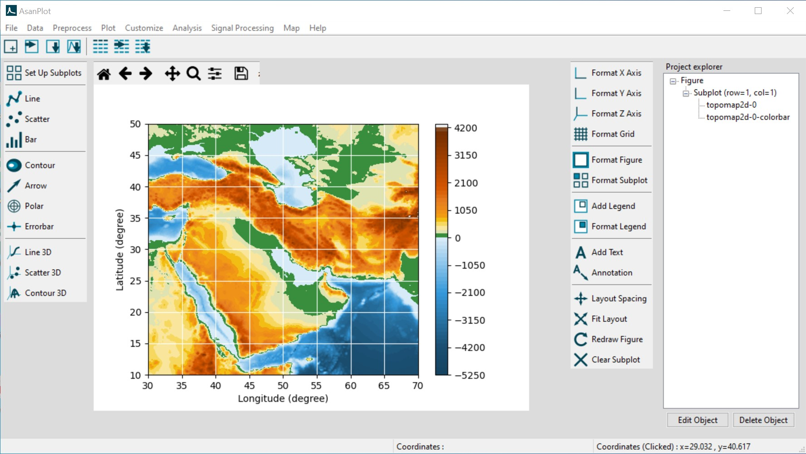

.. YA LATIF

AsanPlot
========

AsanPlot, is a plotting software based on Matplotlib for preparing high quality plots.

This software provides tools for most common 2d and 3d plots.
It can import data from different file types and preprocess and clean them.
For detail tool list, check table below

:Name: AsanPlot
:Description: Plotting software based on Matplotlib
:Version: 1.1
:Requirements: Windows 10 - 64 bit
:Developer: Arash Karimpour (http://www.arashkarimpour.com)
:Documentation:
:Tutorial Video:
:Source Code:
:Report Issues: https://github.com/akarimp/oceanlyz/issues

Installation
------------

To use AsanPlot download setup file, run it, and follow the steps:

* Download AsanPlot:

    * Version 1.1 (GitHub): https://github.com/akarimp/oceanlyz/releases/download/2.0/oceanlyz_2_0.zip

Features
--------

**Data**

========================================   ======
Feature                                    Status
========================================   ======
Import/browse/export data                  [+]
Generate data                              [+]
Data statistics                            [+]
========================================   ======

**Preprocess**

========================================   ======
Feature                                    Status
========================================   ======
Sort data                                  [+]
Replace missing/outliers/value             [+]
Find/fill gap                              [+]
Remove duplicates                          [+]
========================================   ======

**2D Plot**

========================================   ======
Feature                                    Status
========================================   ======
Line                                       [+]
Scatter                                    [+]
Bar                                        [+]
Contour                                    [+]
Arrow                                      [+]
Polar                                      [+]
Errorbar                                   [+]
========================================   ======

**3D Plot**

========================================   ======
Feature                                    Status
========================================   ======
Line                                       [+]
Scatter                                    [+]
Contour                                    [+]
========================================   ======

**Customize Plot**

========================================   ======
Feature                                    Status
========================================   ======
Axis                                       [+]
Grid                                       [+]
Figure/subplot                             [+]
Legend                                     [+]
Text/annotation                            [+]
========================================   ======

**Analysis**

========================================   ======
Feature                                    Status
========================================   ======
Histogram/probability                      [+]
Curve fitting                              [-]
========================================   ======

**Signal Processing**

========================================   ======
Feature                                    Status
========================================   ======
Power spectral density                     [+]
Fast Fourier Transform                     [+]
Design filter                              [-]
Window function                            [-]
Filter data                                [-]
Smooth data                                [-]
========================================   ======

**Map**

========================================   ======
Feature                                    Status
========================================   ======
Topographic map                            [+]
Topographic data                           [+]
World map                                  [+]
========================================   ======

Recommended Book
----------------

* | **Ocean Wave Data Analysis**
  | Introduction to Time Series Analysis, Signal Processing, and Wave Prediction.
  | Order at Amazon: https://www.amazon.com/dp/0692109978
  |
* | **Principles of Data Science with Python**
  | Introduction to Scientific Computing, Data Analysis, and Data Visualization.
  | Order at Amazon: https://www.amazon.com/dp/1735241008
  |
* | **Fundamentals of Data Science with MATLAB**
  | Introduction to Scientific Computing, Data Analysis, and Data Visualization.
  | Order at Amazon: https://www.amazon.com/dp/1735241016

Citation
--------

Cite this software as:

License Agreement and Disclaimer
--------------------------------

AsanPlot: Plotting software

Copyright (c) 2022 Arash Karimpour

All rights reserved

Permission is hereby granted, free of charge, to any person obtaining a copy
of this software and associated documentation files (the "Software"), to deal
in the Software without restriction, including without limitation the rights
to use, copy, modify, merge, publish, distribute, sublicense, and/or sell
copies of the Software, and to permit persons to whom the Software is
furnished to do so, subject to the following conditions:

The above copyright notice and this permission notice shall be included in all
copies or substantial portions of the Software.

THE SOFTWARE IS PROVIDED "AS IS", WITHOUT WARRANTY OF ANY KIND, EXPRESS OR
IMPLIED, INCLUDING BUT NOT LIMITED TO THE WARRANTIES OF MERCHANTABILITY,
FITNESS FOR A PARTICULAR PURPOSE AND NONINFRINGEMENT. IN NO EVENT SHALL THE
AUTHORS OR COPYRIGHT HOLDERS BE LIABLE FOR ANY CLAIM, DAMAGES OR OTHER
LIABILITY, WHETHER IN AN ACTION OF CONTRACT, TORT OR OTHERWISE, ARISING FROM,
OUT OF OR IN CONNECTION WITH THE SOFTWARE OR THE USE OR OTHER DEALINGS IN THE
SOFTWARE.
